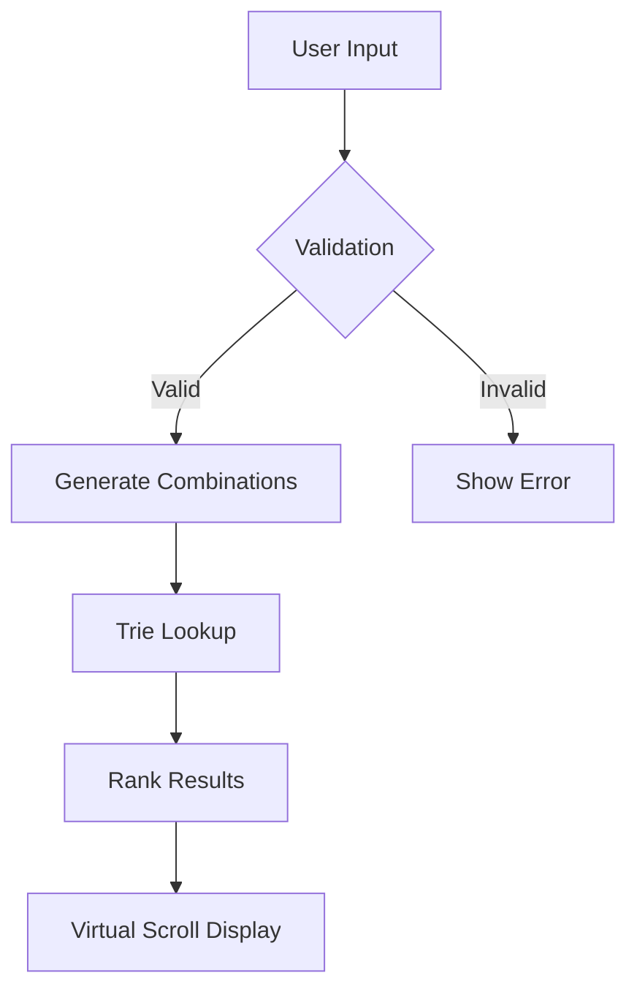

# Word Creator App Project Brief

## Purpose

A web application that generates valid English words from user-provided letter combinations, helping vocabulary building and word game practice. Combines Vue 3 reactivity with efficient dictionary lookups to deliver instant results.

## Components

◻︎ Trie Data Structure — Efficient prefix tree implementation for word storage/retrieval
◻︎ Dictionary Loader — Validate and parse dictionary.txt into trie structure (deps: Trie)
◻︎ Word Matching Service — Core algorithm for finding embedded words (deps: Trie, Dictionary)
◻︎ Input Validation — Sanitize user input per length/special char rules, including ARIA compliance for accessibility
◻︎ Core UI Components — Vue reactive interfaces for input/results display (deps: Validation, Matching)
◻︎ Test Infrastructure — Vitest suite covering trie operations and edge cases
◻︎ Build Configuration — Vite/TypeScript setup verifying tree-shaking compliance

## Target Users

- Word game enthusiasts
- ESL learners
- Educators teaching spelling/vocabulary

## Technical Approach

1. **Vue 3 Components**

   - `WordInput`: Text input with validation (min 4 chars)
   - `WordList`: Virtual-scroll enabled results display
   - `StatsPanel`: Shows matching metrics

2. **Core Services**

   - DictionaryLoader: Fetches public/dictionary.json
   - WordMatcher: Finds embedded words using trie-based lookup
   - ValidationService: Ensures input meets requirements

3. **Testing**
   - Vitest unit tests for core matching logic
   - Playwright E2E tests for UI flows
   - Benchmark tests for dictionary loading

## Acceptance Criteria

✔️ Implement Vue input component with validation messaging  
✔️ Develop algorithm finding all embedded words ≥3 letters  
✔️ Display results in virtual-scroll container with loading states  
✔️ Verify dictionary loads <1s for 200k words  
✔️ Achieve 100% test coverage on WordMatcher service  
✔️ Pass existing ESLint rules with strict type checking

## Constraints

▲ Must use Vite/TypeScript from current workspace  
▲ Dictionary path locked to public/dictionary.json  
▲ Zero ESLint exceptions allowed  
▲ All components must be tree-shakeable

## Algorithm Flow

